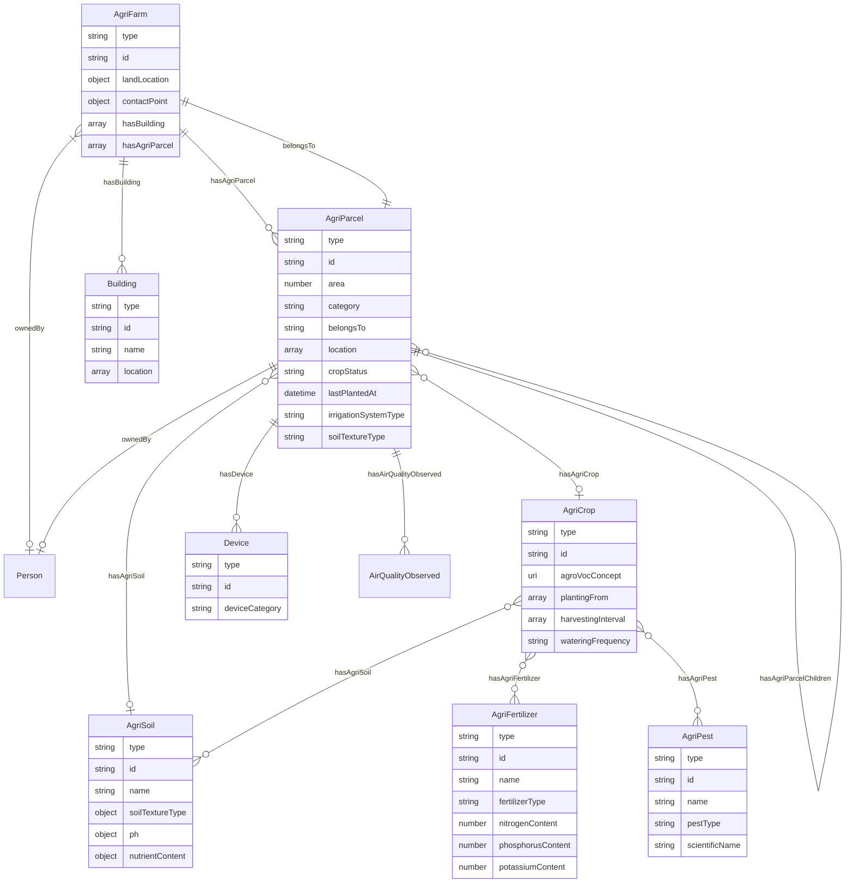

# AgriFood models with relations

**Generated through Cline AI coding agent, and smartdatamodels-mcp server**

```mermaid
erDiagram
    AgriFarm ||--o{ AgriParcel : hasAgriParcel
    AgriFarm ||--o{ Building : hasBuilding
    AgriFarm }|--o| Person : ownedBy
    AgriParcel ||--|| AgriFarm : belongsTo
    AgriParcel }o--o| AgriCrop : hasAgriCrop
    AgriParcel }o--o| AgriSoil : hasAgriSoil
    AgriParcel ||--o{ Device : hasDevice
    AgriParcel ||--o| AgriParcel : hasAgriParcelParent
    AgriParcel ||--o{ AgriParcel : hasAgriParcelChildren
    AgriParcel ||--o| Person : ownedBy
    AgriParcel ||--o{ AirQualityObserved : hasAirQualityObserved
    AgriCrop }o--o{ AgriSoil : hasAgriSoil
    AgriCrop }o--o{ AgriFertilizer : hasAgriFertilizer
    AgriCrop }o--o{ AgriPest : hasAgriPest

    AgriFarm {
        string type
        string id
        object landLocation
        object contactPoint
        array hasBuilding
        array hasAgriParcel
    }

    AgriParcel {
        string type
        string id
        number area
        string category
        string belongsTo
        array location
        string cropStatus
        datetime lastPlantedAt
        string irrigationSystemType
        string soilTextureType
    }

    AgriCrop {
        string type
        string id
        uri agroVocConcept
        array plantingFrom
        array harvestingInterval
        string wateringFrequency
    }

    Building {
        string type
        string id
        string name
        array location
    }

    Device {
        string type
        string id
        string deviceCategory
    }

    AgriSoil {
        string type
        string id
        string name
        object soilTextureType
        object ph
        object nutrientContent
    }

    AgriFertilizer {
        string type
        string id
        string name
        string fertilizerType
        number nitrogenContent
        number phosphorusContent
        number potassiumContent
    }

    AgriPest {
        string type
        string id
        string name
        string pestType
        string scientificName
    }
```
