# Structure des appels de fonctions - Smart Data Models MCP

## Vue d'ensemble

Ce document présente la structure hiérarchique des appels de fonctions dans le fichier `data_access.py` du projet Smart Data Models MCP.

## Fonctions primaires (publiques)

Le système expose 10 fonctions primaires publiques :

1. **`list_domains`** - Liste tous les domaines disponibles
2. **`list_subjects`** - Liste tous les sujets disponibles
3. **`list_models_in_subject`** - Liste les modèles dans un sujet spécifique
4. **`list_domain_subjects`** - Liste les sujets d'un domaine spécifique
5. **`search_models`** - Recherche des modèles par requête
6. **`get_model_details`** - Récupère les détails d'un modèle spécifique
7. **`get_model_schema`** - Récupère le schéma JSON d'un modèle
8. **`get_model_examples`** - Récupère des exemples d'utilisation d'un modèle
9. **`get_subject_context`** - Récupère le contexte JSON-LD d'un sujet
10. **`suggest_matching_models`** - Suggère des modèles correspondant à des données

## Diagramme de structure des appels

```mermaid
graph TD
    %% Fonctions primaires (publiques)
    A[list_domains] --> B[_run_sync_in_thread]

    C[list_subjects] --> D[list_domains]
    C --> E[_get_subjects_from_github_api]
    C --> F[_run_sync_in_thread]

    G[list_models_in_subject] --> H[_get_models_from_github_api]
    G --> I[_run_sync_in_thread]

    J[list_domain_subjects] --> K[_find_domain_repository]
    J --> L[_get_subjects_from_github_api]
    J --> M[_run_sync_in_thread]

    N[search_models] --> O[_github_code_search_first_search]

    P[get_model_details] --> Q[_normalize_subject]
    P --> R[EmbeddedGitHubAnalyzer.generate_metadata]
    P --> S[_get_basic_model_details_from_github]
    P --> T[get_model_schema]
    P --> U[_run_sync_in_thread]

    V[get_model_schema] --> W[_run_sync_in_thread]

    X[get_model_examples] --> Y[_normalize_subject]
    X --> Z[_run_sync_in_thread]
    X --> AA[_get_examples_from_github]
    X --> BB[_generate_basic_example]

    CC[get_subject_context] --> DD[_run_sync_in_thread]
    CC --> EE[_generate_basic_context]

    FF[suggest_matching_models] --> GG[_prefilter_models_with_existing_github]
    FF --> HH[_fallback_model_candidates]
    FF --> II[_analyze_candidate_models]

    %% Fonctions de recherche (détaillées)
    O --> JJ[_search_github_with_code_api]
    O --> KK[_pysmartdatamodels_first_search]

    JJ --> LL[_search_single_term_github]
    LL --> MM[_process_github_search_results]

    KK --> NN[_search_with_pysmartdatamodels]
    KK --> OO[_search_with_additional_pysmartdatamodels_functions]
    KK --> PP[_search_github_excluding_pysmartdatamodels]

    %% Fonctions utilitaires communes
    B --> QQ[GitHub API calls]
    F --> RR[pysmartdatamodels.list_all_subjects]
    I --> SS[GitHub API calls]
    M --> TT[GitHub API calls]
    U --> UU[pysmartdatamodels functions]
    Z --> VV[ngsi_ld_example_generator]
    W --> WW[GitHub API calls]
    DD --> XX[GitHub API calls]

    %% Fonctions de suggestion
    II --> YY[_enhanced_score_model_for_suggestion]
    YY --> ZZ[_calculate_semantic_matches]
    YY --> AAA[_calculate_fuzzy_matches]
    YY --> BBB[_calculate_model_name_relevance]

    GG --> CCC[_get_basic_model_details_from_github]
    HH --> DDD[list_models_in_subject]

    %% Styles
    classDef primary fill:#e1f5fe,stroke:#01579b,stroke-width:2px
    classDef private fill:#f3e5f5,stroke:#4a148c,stroke-width:2px
    classDef utility fill:#e8f5e8,stroke:#1b5e20,stroke-width:2px

    class A,C,G,J,N,P,V,X,CC,FF primary
    class B,D,E,F,H,I,K,L,M,O,Q,R,S,T,U,W,Y,Z,AA,BB,DD,EE,GG,HH,II,JJ,KK,LL,MM,NN,OO,PP private
    class QQ,RR,SS,TT,UU,VV,WW,XX,YY,ZZ,AAA,BBB,CCC,DDD utility
```

## Légende des couleurs

- 🔵 **Bleu clair** : Fonctions primaires (publiques) - Points d'entrée de l'API
- 🟣 **Violet** : Fonctions privées intermédiaires - Logique métier
- 🟢 **Vert** : Fonctions utilitaires - Appels externes et traitements de bas niveau

## Architecture des appels

### Stratégie de recherche optimisée

La fonction `search_models` utilise une stratégie en trois étapes :

1. **GitHub Code Search** (`_github_code_search_first_search`) - Recherche rapide via l'API GitHub
2. **PySmartDataModels** (`_pysmartdatamodels_first_search`) - Recherche locale dans la bibliothèque
3. **GitHub exclusif** (`_search_github_excluding_pysmartdatamodels`) - Recherche complémentaire

### Gestion des données multi-sources

Le système récupère les données depuis plusieurs sources :

- **GitHub API** : Données en temps réel depuis les dépôts smart-data-models
- **PySmartDataModels** : Bibliothèque locale avec cache optimisé
- **Embedded GitHub Analyzer** : Analyseur spécialisé pour les métadonnées
- **Génération de fallback** : Génération de données basiques quand les sources principales échouent

### Optimisations de performance

- **Cache intelligent** : Système de cache avec TTL pour éviter les appels répétés
- **Exécution asynchrone** : Utilisation de `_run_sync_in_thread` pour les opérations I/O
- **Pré-filtrage** : Utilisation de fonctions GitHub pour réduire le nombre de candidats
- **Pagination** : Gestion optimisée des résultats paginés de l'API GitHub

## Métriques du nettoyage

Après nettoyage des fonctions non utilisées :

- **Fonctions conservées** : ~35 fonctions actives
- **Fonctions supprimées** : 6 fonctions obsolètes
- **Complexité réduite** : Code plus maintenable et compréhensible
- **Performance améliorée** : Moins de code mort à charger

Ce diagramme fournit une vue claire de l'architecture du système et facilite la compréhension des dépendances fonctionnelles.
