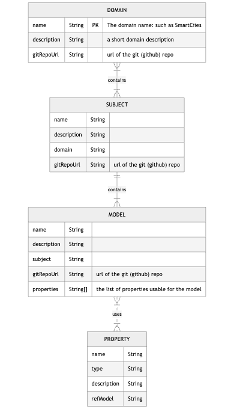
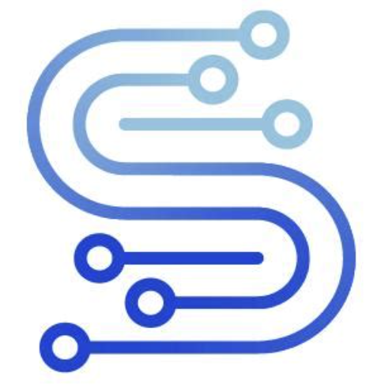

# Smart Data Models MCP Server
## Connecting AI Agents to the FIWARE Ecosystem

---

# What is it?
- A **Model Context Protocol (MCP)** server for **FIWARE Smart Data Models**
- **What is MCP?**: An open standard that enables AI models to seamlessly access external data and tools
- **SDM Discovery Engine**: Instant access to 1,000+ standardized data models
- **NGSI-LD/V2 Powerhouse**: Intelligent generation and validation of IoT entities
- **Multi-Transport**: Production-ready with **stdio**, **SSE**, and **HTTP Streaming**
- **Open to any agent**: Works with Claude Desktop, Cline, Cursor, n8n, etc.

---

# Why Smart Data Models?
- **15+ Domains**: Smart Cities, Energy, Agriculture, Water, etc.
- **Consistency**: Standardized attributes and relationships
- **Interoperability**: NGSI-LD compliant schemas
- **Proven**: Community-driven, industry-vetted, and backed by FIWARE
- **Global Standard**: Used worldwide for digital twin synchronization
- **Schema-First**: Every model is backed by a formal JSON Schema

---

# Key Features of the SDM MCP server
- **🔍 Discover**: Browse 15+ domains and hundreds of subjects
- **🔎 Search**: Advanced search by keywords, attributes, or model names
- **✨ Generate**: Intelligent conversion of raw JSON to NGSI-LD entities
- **✅ Validate**: Real-time schema validation with detailed error reporting
- **💡 Suggest**: Smart model recommendations based on data structure analysis
- **📚 Resources**: Direct access to JSON schemas, examples, and LD-Contexts
- **📊 Intelligence**: Automated detection of GeoProperties and Relationships

---

# SDM Structure
<div align="center">
  
</div>

- **Domains** (e.g., SmartCities) represent high-level sectors
- **Subjects** (e.g., Mobility) group related models
- **Models** (e.g., BikeHireStation) define specific entities
- **Properties** describe attributes and relationships

---

# How it Works
1. **Tool Access**: AI agents call specialized tools (e.g., `search_data_models`)
2. **Data Fetching**: Hybrid strategy using GitHub API and `pysmartdatamodels`
3. **Processing**: Intelligent inference of NGSI-LD types (GeoProperty, Relationship)
4. **Caching**: Robust in-memory caching with 30-minute TTL for API efficiency
5. **Response**: Structured JSON optimized for AI LLM context windows

---

# Available MCP Tools (1/2)
### Exploration & Discovery
- **`list_domains`**: Get an overview of all sectors (Cities, Energy, etc.)
- **`list_subjects`**: Browse all categories within the ecosystem
- **`list_domain_subjects`**: Filter subjects by a specific domain
- **`list_models_in_subject`**: List specific data models (e.g., `WeatherObserved`)
- **`search_data_models`**: Universal search across the entire registry

---

# Available MCP Tools (2/2)
### Data Operations
- **`get_model_details`**: Retrieve schemas, examples, and detailed metadata
- **`validate_against_model`**: Verify if your data follows the official standard
- **`generate_ngsi_ld_from_json`**: Automatic mapping to NGSI-LD format
- **`suggest_matching_models`**: Similarity analysis to find the right model
- **`get_instructions`**: Integrated help for agents to understand capabilities

---

# MCP Resources
Direct URI-based access to core artifacts:
- **`sdm://instructions`**: Dynamic server documentation
- **`sdm://{subject}/{model}/schema.json`**: Official JSON Schemas
- **`sdm://{subject}/{model}/examples/example.json`**: Real-world examples
- **`sdm://{subject}/context.jsonld`**: NGSI-LD / JSON-LD Contexts
- *Enables agents to "read" documentation like a local file*

---

# Installation & Setup
### Install Using UV (Recommended)
```bash
git clone https://github.com/agaldemas/smartdatamodels-mcp
cd smart-data-models-mcp
uv sync
```

### Install From TestPyPI
```bash
pip install --index-url https://test.pypi.org/simple/ smart-data-models-mcp
```

### Set GitHub Token (Optional but Recommended, to avoid rate limiting issues)

Set `GITHUB_READ_TOKEN` to increase API rate limits for extensive searching.

---

# Configuration (Cline / Claude)

### STDIO Mode (Desktop)
```json
{
  "mcpServers": {
    "smart-data-models": {
      "type": "stdio",
      "command": "python3",
      "args": ["src/smart_data_models_mcp/server.py"],
      "cwd": "/path/to/smartdatamodels-mcp"
    }
  }
}
```
### SSE Mode (for n8n / Web Integrations)
- Run with `--transport sse --port 3200`
- Connect at: `http://localhost:3200/sse`

---

# Usage with AI Agent
Once configured, you can ask your agent:
- *"Lister tous les domaines disponibles dans Smart Data Models"*
- *"Trouver des modèles liés à la qualité de l'air"*
- *"Générer une entité NGSI-LD à partir de ces données de capteur : {...}"*
- *"Valider ce fichier Building.json par rapport au schéma officiel"*
- *"Quels modèles correspondraient le mieux à cette structure de données ?"*
- *"Donne moi un exemple d'instance pour le modèle WasteContainer"*

---

# Technical Benefits
- **Asynchronous**: Built on `asyncio` for non-blocking I/O operations
- **Smart Mapping**: Native detection of GeoJSON and NGSI-LD Relationships
- **Resilient**: Graceful fallback between GitHub and local package data
- **Maintainable**: 100% Type-hinted Python code with automated testing
- **Universal**: One server for Cline, Claude, n8n, and custom web apps

---

# Why it Matters for AI?
- **Context is King**: Provides LLMs with exact data structures
- **Zero-Shot Accuracy**: Agents don't guess, they query the standard
- **Interoperability**: Ensures AI-generated data works with FIWARE Orions
- **Scalability**: Access thousands of models without manual configuration
- **Future-Proof**: Bridges the gap between LLMs and Digital Twin standards

---

# Get Started
### Empower your AI agents with standardized data today!

**GitHub**: agaldemas/smartdatamodels-mcp
**Official SDM**: github.com/smart-data-models

*Built with ❤️ for AI Interoperability and the FIWARE Ecosystem*

---
# Thanks !

<div style="display: flex; gap: 20px; align-items: center; justify-content: center; margin-bottom: 20px;">
  
  
</div>

<div style="text-align: center;">
  <strong>Alain Galdemas a faithful Fiware & Smart Data Models supporter & evangelist</strong><br>
  <a href="mailto:alain.galdemas@gmail.com">alain.galdemas@gmail.com</a>
</div>
